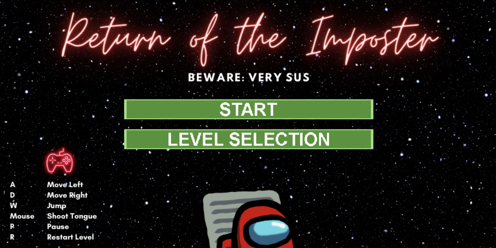

# Return of the Imposter

## Description

Welcome to "Return of the Imposter," a thrilling platform game set in the [Among Us](https://amongusplay.online/) universe. As an imposter on a spaceship, your mission is to navigate through various levels, overcome obstacles, and outwit the crewmates who are determined to thwart your plans. Your ultimate goal is to reach the reactor and destroy the ship. But beware, the crewmates become increasingly vicious as you progress.



## Features

- **Multiple Levels:** Explore diverse environments, with each level increasing in difficulty.
- **Survival:** Reach the vent at the end of each level to advance.
- **Health Points:** Manage your imposter's health. Collisions with obstacles or crewmates will reduce your health. Additionally, crewmates will attack you if you're in their line of sight. If your health depletes entirely, you must restart the level.
- **Power-Ups:** Use the tongue mechanism to shoot at crewmates and get rid of them. Trampolines disguised as black holes can give you momentum in the right direction.
- **Create Levels:** Easily design your own levels using our platform, which is first interpreted using Python, and then translated into C-code.
- **Physics Engine:** Game is built upon a custom-designed physics engine. The imposter's tongue can attach to walls and eliminate enemies, acting as a spring force. Gravity is a constant force within the ship. Collision handling is implemented between all game objects. Realistic physics applies to character movement, with impulses and friction forces.

## How to Play

1. **Controls:**
   - Use the mouse to navigate the user interface (main menu and level selection).
   - Move with WASD keys.
   - Control the imposter's tongue direction by clicking anywhere on the screen.
   - P to pause and go to the main menu.
   - R to restart the level.

## Installation

1. Clone the repository:
   ```bash
   git clone https://github.com/SreeyuR/return-of-the-imposter-game.git

2. Run in the terminal:
   ```bash
   python3 rungame.py
   
## Credits

This game was created by [Sreeyutha Ratala](https://github.com/SreeyuR), Misha Mints, Sophia Stiles, and Annika Viswesh.

## License

This project is licensed under the [License Name] - see the LICENSE.md file for details.

## Feedback and Contributions
If you have any questions, suggestions, or want to contribute to the project, please don't hesitate to reach out to the development team or to open an issue on GitHub.

Enjoy the game, and remember, stay SUS!
